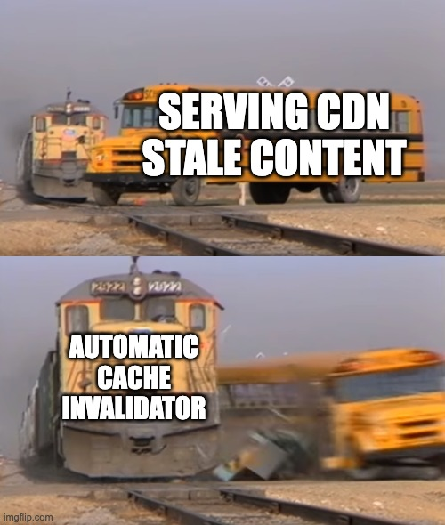
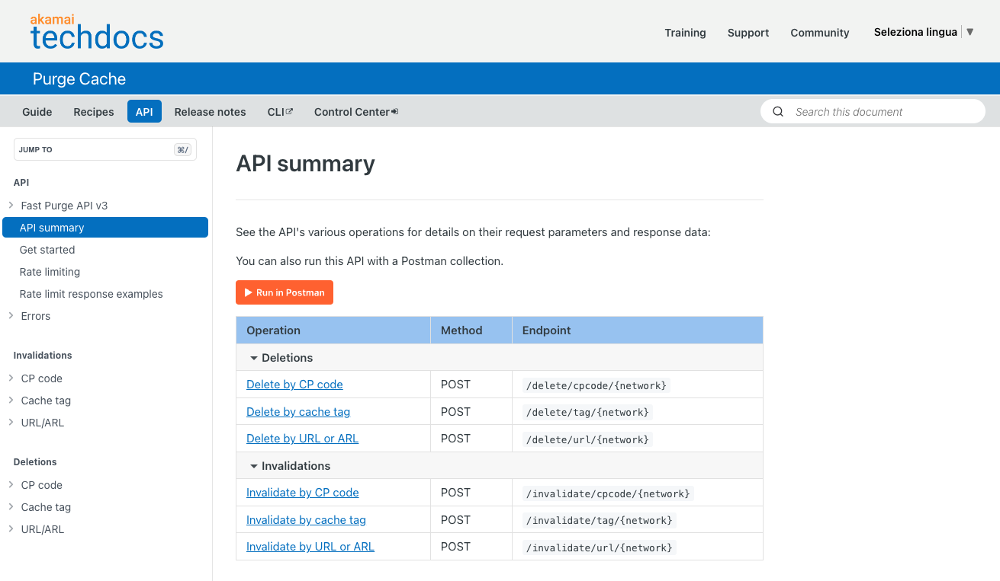
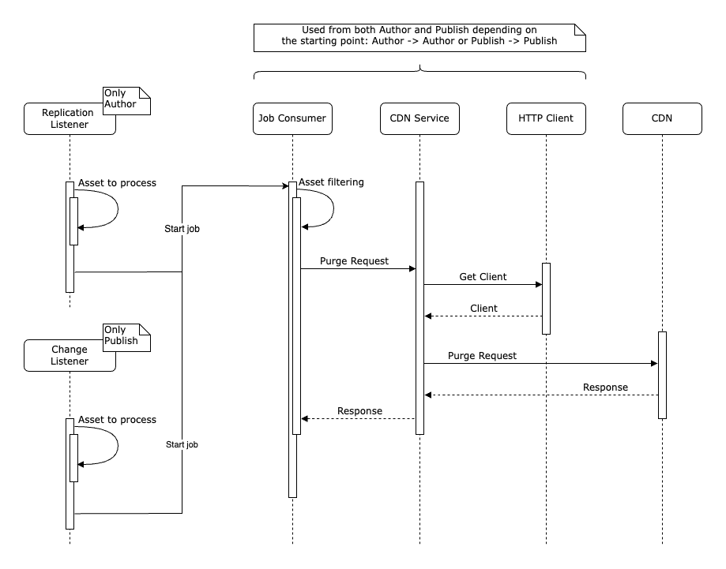
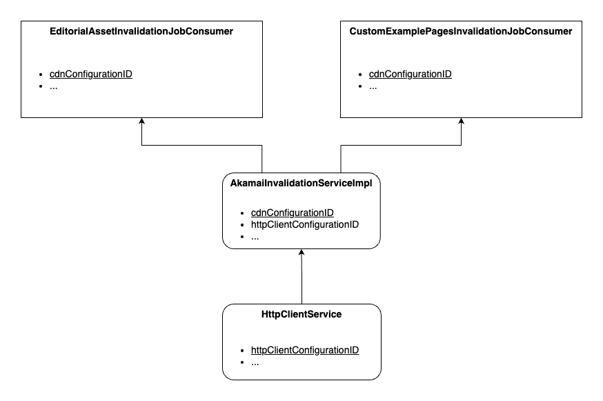
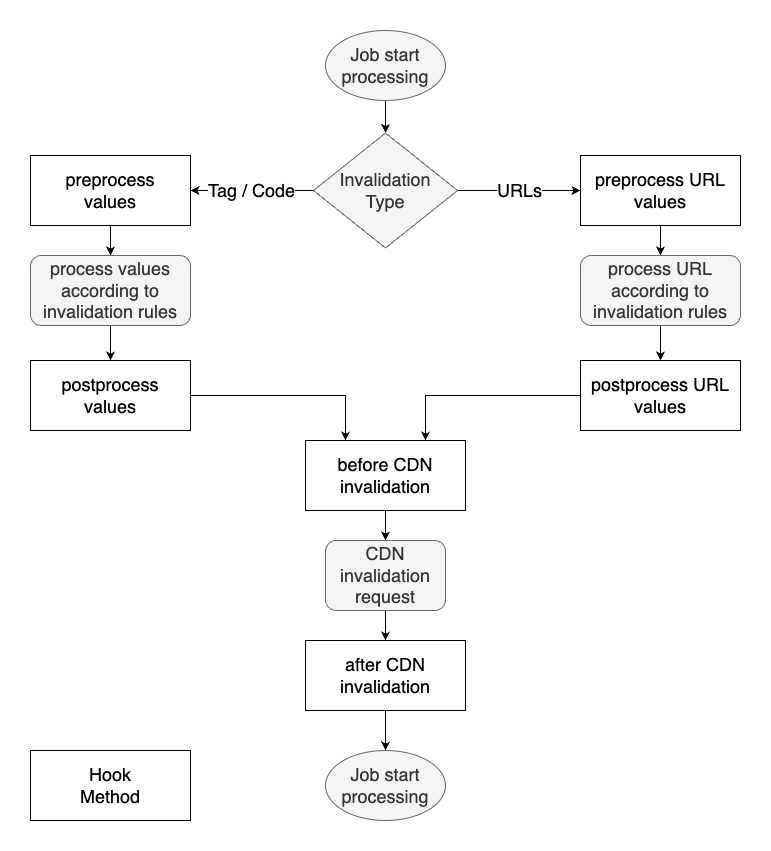

# Automatic CDN Cache Invalidator for AEM

This AEM library **automates invalidating** cached content in content delivery networks (CDN) when **publishing updates** in AEM. It improves website performance, security, and flexibility.

The library listens for AEM replication and resource change events. It then triggers **background jobs** to invalidate cached CDN URLs, tags or codes per **configurable rules**. Out-of-the-box integrations, APIs, and extension points allow flexibly invalidating multi-CDN caches.



**Key Features:**

- **Flexible CDN integrations** - Supports [Akamai](https://www.akamai.com) out-of-the-box. Easily extend for other CDNs via APIs
- **Automatic invalidation triggering** - Listens for AEM publish events and replication
- **Configurable invalidation rules** - Invalidates by URL, tag or code based on configurations
- **Background async processing** - Offloads CDN calls to optimize performance
- **Logs** - Detailed logging for tracking and alerts integration
- **Akamai support built-in** - Akamai Purge API are integrated 
- **Flexible CDN integrations** - Easily extendable for other CDNs via APIs
- **Extension APIs** - Hooks to personalize behavior

Project supports Akamai CDN by default and this chapter will show you how to use the built-in support, but you can customize the invalidation behaviour by changing the configurations according to your needs.
If you want to use a different content delivery networks provider or modify slightly the default logic, you can define new implementations or extend the code by overriding some of the available hook methods. See paragraph "Implementing a Custom CDN Provider" for more details.

## How to use - Enabling Akamai CDN Integration

### Purging content with Akamai API

The project includes reusable services, listeners and jobs supporting caching scenarios like:

- Invalidating pages or assets **by URL**
- Website sections **by tag or code**

The following are the Akamai Purge APIs supported out of the box:
- [invalidation](https://techdocs.akamai.com/purge-cache/reference/invalidate-tag) and [deletion](https://techdocs.akamai.com/purge-cache/reference/delete-tag) by Tag
- [invalidation](https://techdocs.akamai.com/purge-cache/reference/invalidate-cpcode) and [deletion](https://techdocs.akamai.com/purge-cache/reference/delete-cpcode) by CP Code
- [invalidation](https://techdocs.akamai.com/purge-cache/reference/invalidate-url) and [deletion](https://techdocs.akamai.com/purge-cache/reference/delete-url) by URL



### Requirements

When package "all" is installed, it will create a service user named autocdninvalidatorReadService (see [here](ui.config/src/main/content/jcr_root/apps/autocdninvalidator/osgiconfig/config/org.apache.sling.jcr.repoinit.RepositoryInitializer~autocdninvalidator.cfg.json)). 

It is mandatory to verify that service user have read access to all the paths configured to be listened for.

### Configuring and Using Akamai

The ui.config.example module provides out-of-the-box support for invalidating cached content in Akamai CDN based on AEM events.



To enable Akamai integration:

1. Install the sample configurations from ui.config.example - OR - manually create OSGi config through /system/console/configMgr
2. Populate your Akamai credentials and settings in [AkamaiInvalidationServiceImpl]((ui.config.example/src/main/content/jcr_root/apps/autocdninvalidator-example/osgiconfig/config/com.baglio.autocdninvalidator.core.service.impl.AkamaiInvalidationServiceImpl.cfg.json)) config file:
   - hostname
   - client token
   - access token
   - client secret
3. Choose to listen for AEM events on Author OR Publish:
   - Author - ReplicationEventListener detects publish events
   - Publish - ResourceChangeListener detects content updates

Update the placeholder values in the AkamaiInvalidationServiceImpl [configuration](ui.config.example/src/main/content/jcr_root/apps/autocdninvalidator-example/osgiconfig/config/com.baglio.autocdninvalidator.core.service.impl.AkamaiInvalidationServiceImpl.cfg.json) file with your credentials and settings from the Akamai portal: *hostname*, *getAkamaiClientToken*, *getAkamaiAccessToken*, *getAkamaiClientSecret*.

The included samples demonstrate purging:

- Pages under the website root by [tag](ui.config.example/src/main/content/jcr_root/apps/autocdninvalidator-example/osgiconfig/config/com.baglio.autocdninvalidator.core.jobs.EditorialAssetInvalidationJobConsumer.cfg.json)
- Child pages under a specific root page by [URL](ui.config.example/src/main/content/jcr_root/apps/autocdninvalidator-example/osgiconfig/config/com.baglio.autocdninvalidator.core.jobs.ProductPagesInvalidationJobConsumer.cfg.json)

You can find detailed information about each configuration property further below in this document.

The following diagram illustrates how different parts of the code work together to perform invalidation on the Akamai CDN. 



The diagram consists of three main components:

- [HttpClientService](core/src/main/java/com/baglio/autocdninvalidator/core/service/HttpClientService.java): This is a service interface that provides a configured HTTP client for making requests to the Akamai API. It has a property called Configuration ID that uniquely identifies the configuration.
- [AkamaiInvalidationServiceImpl](core/src/main/java/com/baglio/autocdninvalidator/core/service/impl/AkamaiInvalidationServiceImpl.java): This is a service implementation that uses the Akamai Purge API to invalidate content on the CDN. It leverages the HttpClientService service by specifying the HTTP Client Configuration ID property that matches the Configuration ID of the desired HTTP client.
- [EditorialAssetInvalidationJobConsumer](core/src/main/java/com/baglio/autocdninvalidator/core/jobs/EditorialAssetInvalidationJobConsumer.java): This is a job consumer that is responsible for computing the items to invalidate based on the content changes. It uses the AkamaiInvalidationServiceImpl service by specifying the CDN Configuration ID property that matches the hostname of the Akamai configuration.
- [CustomExamplePagesInvalidationJobConsumer](core/src/main/java/com/baglio/autocdninvalidator/core/jobs/CustomExamplePagesInvalidationJobConsumer.java): This is custom job consumer that invalidates specific children pages by URLs. It is an example of how to extend the EditorialAssetInvalidationJobConsumer.

See the code and javadocs for details on how the provided Akamai integration works. You can use it as a reference for calling the Akamai API.

## Implementing a Custom CDN Provider

To use the library with other content delivery network providers:

1. Create a class implementing the CdnInvalidationService interface. This defines the key methods to invalidate by tag, code and URL.

2. Add logic in your class to call your CDN's API based on the provided parameters. Refer to the Akamai service class for sample code.

3. Configure your service class via the OSGi config manager, providing any necessary credentials and settings.
d
4. Update the CDN Configuration ID on the EditorialAssetInvalidationJobConsumer to match your custom service.

You can also override methods on the AbstractInvalidationJob class if you need to preprocess data or customize the invalidation logic by overriding one of the following hooks methods:
- The `preprocessInvalidationValues` method is a hook method that is called before processing the values to be used with invalidation by code/tag service. It takes a set of content paths as a parameter and returns a set of initial values to be used for as input for items of CDN service.
- The `postprocessInvalidationValues` method is a hook method that is called after processing the invalidation values and before calling CDN service. It takes a set of invalidation values as a parameter and returns a set of finalized values to be used for as input for items of CDN service.
- The `preprocessPublicUrls` method is a hook method that is called before processing the public URLs to be used with invalidation by URLs service. It takes a set of content paths as a parameter and returns a set of updated paths.
- The `postprocessPublicUrls` method is a hook method that is called after processing the public URLs and before calling CDN service. It takes a set of public URLs as a parameter and returns a set of updated URLs.
- The `beforeInvalidation` method is a hook before making the invalidation call to the CDN. It takes the processed invalidation values and returns updated values.
- The `afterInvalidation` method is a hook after the CDN invalidation call. It takes the invalidation result and job and returns a boolean indicating success.



See the javadocs for more details.

## Custom Job Queue Configuration and tuning

The default job queue can be customized by creating OSGi configurations for the job topic of interest. This allows controlling parameters like parallelism, retries, priority etc.

For example, you can create a configuration with the following properties:

- queue.name: Name of the queue
- queue.type: Ordered, unordered etc.
- queue.topics: Job topics that this queue handles
- queue.maxparallel: Number of parallel jobs
- queue.retries: Retry count on failure
- queue.priority: Job thread priority

See [Sling documentation](https://sling.apache.org/documentation/bundles/apache-sling-eventing-and-job-handling.html#job-handling) for more details on available queue configuration parameters. 
By default, both the job topics provided with ui.config.example ([here](ui.config.example/src/main/content/jcr_root/apps/autocdninvalidator-example/osgiconfig/config/com.baglio.autocdninvalidator.core.jobs.EditorialAssetInvalidationJobConsumer.cfg.json) and [here](ui.config.example/src/main/content/jcr_root/apps/autocdninvalidator-example/osgiconfig/config/com.baglio.autocdninvalidator.core.jobs.CustomExamplePagesInvalidationJobConsumer.cfg.json)) will use the Sling default queue. But you can create a custom OSGi config with higher priority to override properties for your jobs.

## Components and Services

The main building blocks of this project are:

- [HttpClientService](core/src/main/java/com/baglio/autocdninvalidator/core/service/HttpClientService.java): a service interface for obtaining a configured HTTP client.
- [HttpClientServiceImpl](com/baglio/autocdninvalidator/core/service/impl/HttpClientServiceImpl.java): an implementation of the HttpClientService that returns a HTTP client to communicate with the CDN provider.
- [CdnInvalidationService](core/src/main/java/com/baglio/autocdninvalidator/core/service/CdnInvalidationService.java): a service interface for invalidating CDN cache by different criteria.
- [AkamaiInvalidationServiceImpl](core/src/main/java/com/baglio/autocdninvalidator/core/service/impl/AkamaiInvalidationServiceImpl.java): an implementation of the CdnInvalidationService that uses the Akamai Purge API to invalidate or delete content from the Akamai CDN by leveraging configured HttpClientService.
- [ReplicationEventListener](core/src/main/java/com/baglio/autocdninvalidator/core/listeners/ReplicationEventListener.java): a service that is activated on author only and listens for replication events. It provides common logic to filter paths, create jobs, and offload work to the job consumers.
- [DynamicResourceChangeListener](core/src/main/java/com/baglio/autocdninvalidator/core/listeners/DynamicResourceChangeListener.java): a service that is activated on publish only. It listens for resource change events and performs the same logic as the ReplicationEventListener.
- [EditorialAssetInvalidationJobConsumer](core/src/main/java/com/baglio/autocdninvalidator/core/jobs/EditorialAssetInvalidationJobConsumer.java): a job consumer that invalidates CDN cached assets like website pages or DAM assets. It supports different types of invalidation, such as URLs, tag, or code.
- [CustomExamplePagesInvalidationJobConsumer](core/src/main/java/com/baglio/autocdninvalidator/core/jobs/CustomExamplePagesInvalidationJobConsumer.java): a custom job consumer that invalidates specific children pages by URLs. It is an example of how to extend the EditorialAssetInvalidationJobConsumer.

The application allows you to configure various properties for each service to suit your needs and preferences. These properties control how the service interacts with the Akamai API, the content changes, and the invalidation process. You can find a detailed explanation of each property and how to set it in the next chapter.

### Configuration Properties

Each component has its own configuration properties that can be set via the OSGI Config Manager console. The configuration properties are described in detail in the javadoc of each component. Here is a summary of the configuration properties for each component:

- [HttpClientServiceImpl](com/baglio/autocdninvalidator/core/service/impl/HttpClientServiceImpl.java): this service has the following configuration fields:
  - Configuration ID: a unique identifier for the configuration
  - HTTP Connection Timeout: the value in milliseconds that determines how long the HTTP client will wait for a connection to be established
  - HTTP Connection Request Timeout: the value in milliseconds that determines how long the HTTP client will wait for a connection to be available from the connection pool
  - HTTP Socket Timeout: the value in milliseconds that determines how long the HTTP client will wait for data to be received or sent
  - HTTP Max Total Connections: the maximum number of connections that the HTTP client can open
  - HTTP Max Connections per Route: the maximum number of connections that the HTTP client can open for a given route
- [AkamaiInvalidationServiceImpl](core/src/main/java/com/baglio/autocdninvalidator/core/service/impl/AkamaiInvalidationServiceImpl.java): this service has the following configuration fields:
  - Enable: a boolean flag that indicates whether the service is enabled or not
  - Configuration ID: a unique identifier for the configuration
  - Akamai Client secret: the client secret for the Akamai API authentication
  - Akamai Access token: the access token for the Akamai API authentication
  - Akamai Client token: the client token for the Akamai API authentication
  - Akamai Hostname: the hostname of the Akamai CDN endpoint
  - Akamai network: the network on which you want to invalidate or delete content, either staging or production
  - Akamai purge type: the type of purge to use, either invalidation or deletion
  - HTTP Client Configuration ID: the configuration ID to use for HTTP connections
- [ReplicationEventListener](core/src/main/java/com/baglio/autocdninvalidator/core/listeners/ReplicationEventListener.java) and [DynamicResourceChangeListener](core/src/main/java/com/baglio/autocdninvalidator/core/listeners/DynamicResourceChangeListener.java): these services are OSGI factories and have the following configuration fields:
  - Enable: a boolean flag that indicates whether the service is enabled or not
  - Filter Paths: list of root paths for observed events. Regex are not supported here.
  - Events: list of change types (such as CHANGED, ADDED, or REMOVED) to listen for
  - Target Job Topic: the topic of job consumer will be used to process data
  - Filter Regex: the pattern to identify page or asset which must be processed
- [EditorialAssetInvalidationJobConsumer](core/src/main/java/com/baglio/autocdninvalidator/core/jobs/EditorialAssetInvalidationJobConsumer.java): this service is also an OSGI factory and has the following configuration fields:
  - Enable: a boolean flag that indicates whether the service is enabled or not
  - Job Topic: topic this consumer is able to process
  - CDN Configuration ID: CDN configuration to leverage
  - Type of Invalidation: the type of purge to be leveraged, either URLs, tag, or code
  - Tag/Code Mappings: list defining the pattern to tag or code associations for invalidation rules.
  - External Link Domain: externalizer domain to create the absolute URL.
  - External Link Protocol Scheme: protocol scheme that will be part of the absolute URLs.
- [CustomExamplePagesInvalidationJobConsumer](core/src/main/java/com/baglio/autocdninvalidator/core/jobs/CustomExamplePagesInvalidationJobConsumer.java): this service inherits the configuration fields from the EditorialAssetInvalidationJobConsumer and has no additional fields.

### Configuring Event Listeners

The [ReplicationEventListener](core/src/main/java/com/baglio/autocdninvalidator/core/listeners/ReplicationEventListener.java) and [DynamicResourceChangeListener](core/src/main/java/com/baglio/autocdninvalidator/core/listeners/DynamicResourceChangeListener.java) have key properties to filter observed events:

**Filter Paths**

Defines root content trees to listen for changes under. Do not use regular expressions as they are not supported here.

See configuration file [ReplicationEventListener-website-generic.cfg.json](ui.config.example/src/main/content/jcr_root/apps/autocdninvalidator-example/osgiconfig/config.author/com.baglio.autocdninvalidator.core.listeners.ReplicationEventListener-website-generic.cfg.json) for a detailed example.

```
"resource.paths": [
    "/content/we-retail",
    "/content/wknd"
]
```

**Filter Regex**

Further filters events by matching full content paths against the regex pattern. Use groups to extract values.

For example:

```
"filter.regex": "^/content/(we-retail|wknd)(?!.*products)(?!.*adventures).*$"
```

This listens for changes under /content/we-retail and /content/wknd. It matches pages and assets, while filtering out paths containing "products" or "adventures".

See configuration file [ReplicationEventListener-website-generic.cfg.json](ui.config.example/src/main/content/jcr_root/apps/autocdninvalidator-example/osgiconfig/config.author/com.baglio.autocdninvalidator.core.listeners.ReplicationEventListener-website-generic.cfg.json) for a detailed example.

**Tips:**

- Filter broad trees in Filter Paths, then refine with Filter Regex
- Use negative lookaheads in regex to ignore subgroups
- Capture values via regex groups for custom processing

## Build

### System Requirements

This code has been tested with the following software versions:

 AEM as a Cloud Service | AEM 6.5  | Java SE | Maven
------------------------|----------|---------|---------
2023.10.13804.20231005T183332Z | 6.5.0 | 11 | 3.9.4


### How to build

To learn how to build the project, please refer to [README-BUILD.md](README-BUILD.md).


### Local CDN Simulation

For testing locally without an actual content delivery network, you can simulate CDN calls using [mendhak/http-https-echo](https://github.com/mendhak/docker-http-https-echo).

This Docker image echoes back HTTP requests and responds based on configuration options. You can observe request handling, headers, payloads etc. without an external endpoint.

To use:

1. Run the Docker image on ports 8080 and 8443:

    ```
    docker run -p 8080:8080 -p 8443:8443 --rm -t mendhak/http-https-echo:30
    ```

2. Configure your CDN invalidator service to call `https://localhost:8443`. Request data will be echoed back in responses and container logs.

3. Verify CDN invalidator handling, payloads, errors etc.

4. When ready, switch the configuration to call your actual CDN endpoints.

See the [http-https-echo](https://github.com/mendhak/docker-http-https-echo) documentation for additional options to manipulate responses.

# Planned Enhancements

 - Junit testing: Improve unit and integration test coverage using JUnit
 - CDN Provider Support: Expand built-in support for additional CDN providers